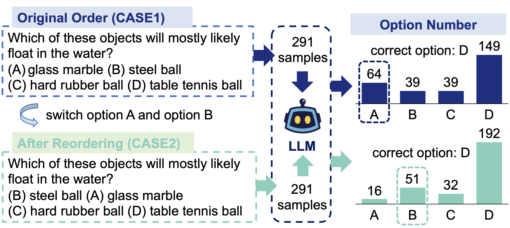

# Can multiple-choice questions really be useful in detecting the abilities of LLMs?

<table align="center" style="border: 1px solid white;">
  <tr>
    <td style="border: 1px solid white;"></td>
    <td style="border: 1px solid white;"></td>
  </tr>
</table>

Multiple-choice questions (MCQs) are commonly used to evaluate the knowledge and abilities of large language models (LLMs) because of their simple format and efficient inference process. However, there are concerns about **whether MCQs can truly assess the true capabilities of LLMs**. This is particularly relevant because LLMs are often used in knowledge-intensive scenarios where they are expected to generate long-form content. Using MCQs for evaluation can introduce a misalignment between what is being tested and what is actually required in these scenarios.

**Authors**:

<div style="overflow: hidden;">
  <ul>
    <li>Wangyue Li  (<a href="mailto:alee90792@gmail.com">alee90792@gmail.com</a>)
    <li>Liangzhi Li (<a href="mailto:liliangzhi@xiaoyouzi.com">liliangzhi@xiaoyouzi.com</a>)
    <li>Tong Xiang  (<a href="mailto:xiangtong@xiaoyouzi.com">xiangtong@xiaoyouzi.com</a>)
    <li>Xiao Liu (<a href="mailto:liuxiao@xiaoyouzi.com">liuxiao@xiaoyouzi.com</a>)
    <li>Wei Deng (<a href="mailto:dengwei@swufe.edu.cn">dengwei@swufe.edu.cn</a>)
    <li>Noa Garcia  (<a href="mailto:noagarcia@ids.osaka-u.ac.jp">noagarcia@ids.osaka-u.ac.jp</a>)<sup>*</sup>
  </ul>
</div>

<sup>*</sup>Corresponding author.

## Table of Contents
1. [Overview](#1)
2. [Datasets and Models](#2)
3. [Are LLMs sensitive to the order of candidate answers?](#3)
4. [Multiple Choice Questions vs Long Form Generation Questions](#4)
5. [Citation](#citation)

<h2 id="1">Overview</h2>
We start by demonstrating that LLMs exhibit a order sensitivity in bilingual MCQs, the Chi-square test of order sensitivity indicates that the order of options is a significant factor that influences the choices made by the LLMs. To quantify the gap between MCQs and long-form generation questions (LFGQs), we conduct experiments comparing their direct outputs, [token logits](#6), and embeddings. We propose two methods that can quantify the consistency and confidence of LLMs’ output which can be generalized to other QA evaluation benchmarks, and we preliminarily deny the idea "the more consistent, the more accurate". Moreover, MCQs may be less reliable than LFGQs in term of expected calibration error. Our analysis reveals that, the misalignment between answering MCQs and LFGQs is not only reflected in their evaluation performance, but also manifested in embedding space.

<h2 id="2">Datasets and Models</h2>
To investigate the preferences of LLMs to the order of options and the differences between MCQs and LFGQs, we conduct experiments on six evaluation benchmarks.
The evaluation benchmarks that we use are listed below:

| **Source**                                                                                   | **Language**   | **Size**      |
|----------------------------------------------------------------------------------------------|----------------|--------------:|
|[CARE-MI](https://github.com/Meetyou-AI-Lab/CARE-MI)   | ZH           |            1612 |
|[MLEC-QA](https://github.com/Judenpech/MLEC-QA)                                      | ZH            |            136236 |
|[MEDQA](https://arxiv.org/abs/2009.13081)                                                                                           | ZH/EN             |            61,097 |
|[M3KE](https://github.com/tjunlp-lab/M3KE)                 | ZH             |           20477  |
|[ARC](https://arxiv.org/abs/1803.05457)                 | EN             |           7,787 |
|[MATH]                                                | EN           |           300 |

The samples of the benchmarks we use can be found in `Datasets`.

The paper is currently on [arXiv](https://arxiv.org/abs/XXXXX). 

<h2 id="3">Are LLMs sensitive to the order of candidate answers?</h2>
We first find that when the LLMs are presented with some options in different orders, they consistently show a strong preference for the same position, as illustrated in the following figure. We have two cases of option order, in CASE1, the option numbering is ’ABCD’, and in CASE2, theo ption numbering is ’BACD’. It is worth noting that when changing the option numbering, the contents of each option and their positions will be adjusted accordingly, rather than simply altering the option numbering, as shown in Figure 1. The ground truth is always D. The LLM prefers wrong options in the first position in the ARC dataset.
<figure style="text-align: center;">
  
  <figcaption style="text-align: center;">Order Preference Image</figcaption>
</figure>

To determine if there are significant differences in the options chosen by the LLMs in these two cases, we conduct a Chi-Square test [(McHugh, 2013)](https://github.com/Meetyou-AI-Lab/CARE-MI) for significance testing.
<h2 id="4">Multiple Choice Questions vs Long Form Generation Questions</h2>
<h3 id="5">Direct Output</h3>
<h3 id="6">Token Logits</h3>
<h3 id="7">Embeddings</h3>

## Citation

**If the paper, codes, or the dataset inspire you, please cite us:**

```
@article{XXX
  title={Can multiple-choice questions really be useful in detecting the abilities of LLMs?},
  author={XXX},
  journal={arXiv preprint arXiv:XXXX},
  year={2023}
}
```
